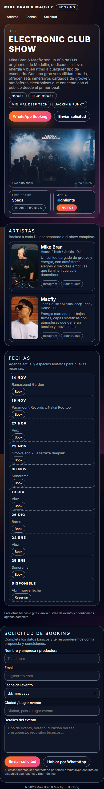
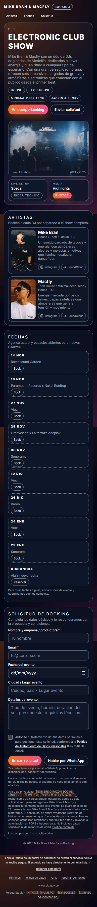
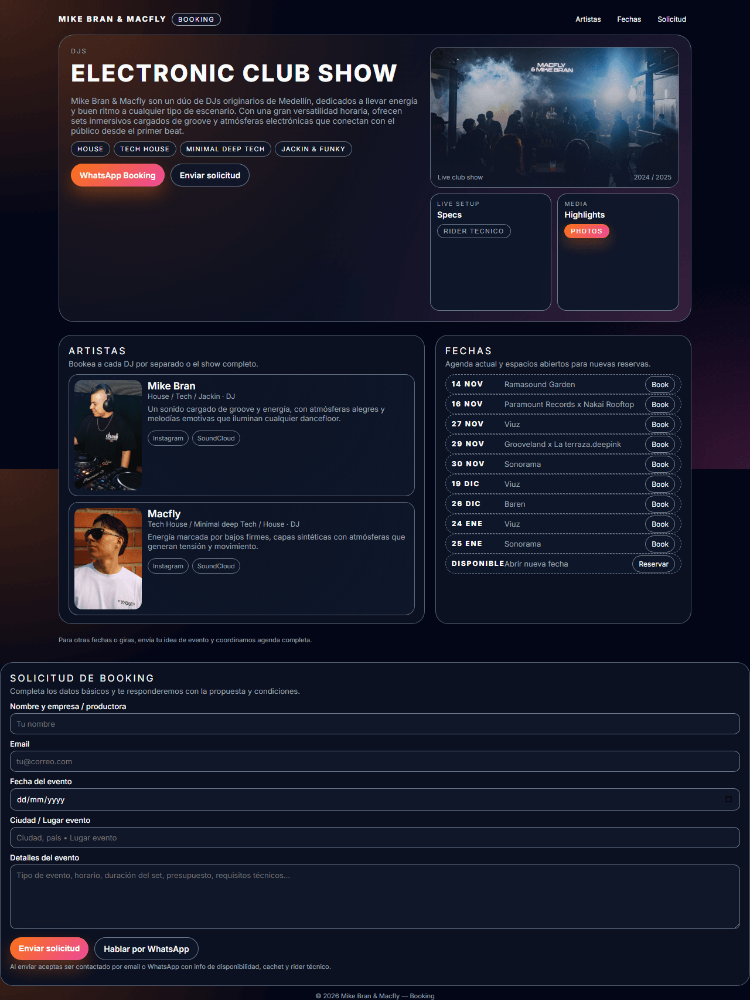
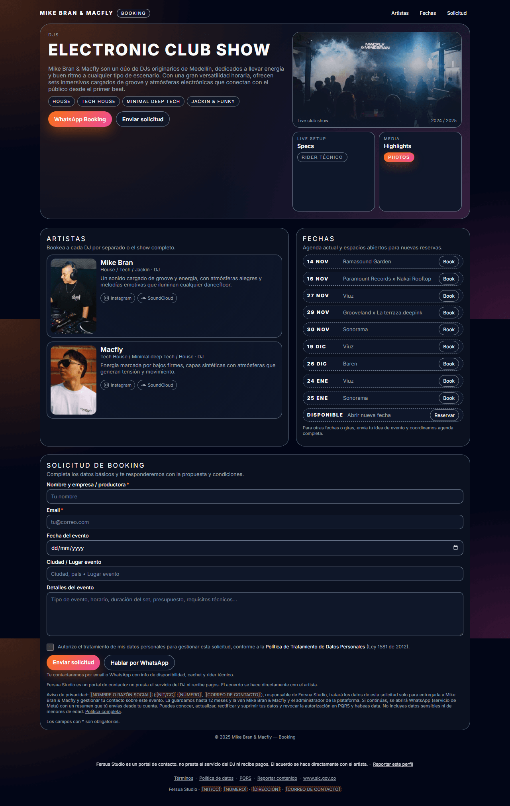

# Comparación visual: página original vs. nueva (Mac Fly & Mike Bran)

Capturas de página completa tomadas el 2026-09-29 con Chromium (Playwright), a los dos anchos de
la regresión visual: **móvil 390×844** y **escritorio 1280×800**.

| | Original (`public_html/MacflyMikebran.html`) | Nueva (`/macfly-mike-bran`) |
|---|---|---|
| Móvil 390 |  |  |
| Escritorio 1280 |  |  |

**Contenido de la nueva:** el de la semilla (`api/src/cli/seed-data/macfly.ts`) con las fotos de
`api/seed-assets` reducidas, y el reloj fijo en el 1 de noviembre de 2025 para que las 9 fechas
salgan como próximas, igual que en la original. **En producción esas fechas ya pasaron:** quedan
en el archivo y la sección "Fechas" solo muestra la fila "Disponible" hasta cargar fechas nuevas
desde el admin.

## Diferencias a propósito

1. **Estructura corregida.** La original tenía un `</div>` suelto: la nota "Para otras fechas o
   giras…" quedaba fuera de la tarjeta de Fechas y el formulario de booking se salía del ancho de
   la página (pegado al borde izquierdo en escritorio). En la nueva ambos quedan dentro de la
   columna. El contenedor de las fechas también estaba comentado por error: ahora las filas tienen
   la separación de 8 px que definía la plantilla.
2. **Formulario legal (Ley 1581).** "Al enviar aceptas ser contactado…" era un consentimiento por
   clic, que no vale (Res. SIC 76538). Ahora hay una casilla de autorización con enlace a la
   política, el aviso de privacidad breve, el aviso de portal de contacto ("Fersua Studio no presta
   el servicio del DJ…"), los asteriscos de campos obligatorios y la línea informativa "Te
   contactaremos por email o WhatsApp…".
3. **Pie legal nuevo:** aviso de portal, "Reportar este perfil", Términos, Política de datos, PQRS,
   Reportar contenido, www.sic.gov.co y los datos del responsable. Los recuadros como
   `[NIT/CC]` y `[DIRECCIÓN]` son marcadores que Fernando debe completar en
   `web/src/public/legal/operator.ts` antes de indexar el sitio.
4. **Móvil más usable:** los campos usan letra de 16 px (el iPhone ya no hace zoom al tocarlos), los
   enlaces y botones pequeños tienen un área táctil invisible de 44 px (se ven igual) y hay foco
   visible con teclado (`:focus-visible`).
5. **Redes con ícono.** Los botones Instagram y SoundCloud de cada integrante llevan su ícono, y los
   enlaces de SoundCloud ya no tienen los parámetros de rastreo (`utm_*`, `si=`).
6. **Botón "Book" de cada fecha:** si la fecha tiene flyer, abre el flyer (como las páginas viejas de
   `Eventos/`); si no, va a WhatsApp con el mensaje "Quiero estar en el evento de {lugar} ({fecha})".
   La original mandaba el texto literal "{nombre del evento}".
7. **Tildes y textos:** "RIDER TÉCNICO" con tilde. El año del pie sale de la fecha actual (en la
   captura dice 2025 por el reloj fijo).
8. **Galería:** 8 fotos. La original enlazaba también `photo-9` a `photo-12`, que no existen (se
   veían rotas).
9. **Colores:** los rgba fijos de la plantilla pasaron a variables de la paleta (SUNSET para Mac
   Fly). El resultado se ve igual; la diferencia es que ahora cada DJ puede elegir una de las 8
   paletas.

**No es una diferencia:** las franjas del fondo cada ~800 px aparecen en las dos. Son de la captura
de página completa (el degradado del fondo está fijo a la ventana), no de la página.

## Cómo repetirlo

Desde `web/`, con el build hecho (`npm run build -w web`):

```bash
FERSUA_ORIGINAL_HTML="C:/Fernando/Desarrollo/hostinger/public_html/MacflyMikebran.html" \
  npx playwright test -c playwright.config.ts compare-original
```

El comando escribe los 4 PNG en esta carpeta sin comprimir. Los de aquí se pasaron a PNG con paleta
para que pesen ~200 kB cada uno. La regresión visual automática es `npm run test:visual -w web`
(capturas de referencia en `web/tests/visual/__screenshots__/`).
